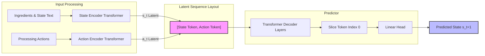

# Recipe JEPA (Joint-Embedding Predictive Architecture)
`jepa-cook` is a research implementation for training a specialized **Joint-Embedding Predictive Architecture (JEPA)** model designed for prediction of the final system state based on ingredients and recipe actions.

Unlike typical generative text models, this model captures knowledge within a narrow domain by treating state changes as non-generative trajectories—efficiently interpolating the semantic space between base components.

Model on [HF](https://huggingface.co/DzmitryAshkinadze/jepa-cook/tree/main)

## Key Features
- **JEPA Architecture**: Maps raw ingredients and processing sequences into a stable, continuous latent space.
- **VICReg Loss**: Implements a loss function based on **Variance-Invariance-Covariance Regularization** to prevent representation collapse.
- **System Diagnostics**: Includes a comprehensive built-in topology check to monitor layer variances, embedding scales, and attention weights for representation degradation.

## Data
Was taken from [here](https://www.kaggle.com/datasets/wilmerarltstrmberg/recipe-dataset-over-2m?resource=download) - Just put the CSV in `data/` directory

## Tech Stack
- **Core**: [PyTorch](https://pytorch.org/)
- **NLP**: [Hugging Face Transformers](https://huggingface.co/docs/transformers/index)
## Installation
Ensure you have Python 3.12 or newer installed. You can install and synchronize all dependencies using `uv`:
```bash
uv sync
```

## Project Architecture
```
jepa-cook/
├── config.yaml             # Centralized hyperparameter and file-path configuration
├── pyproject.toml          # Packaging, dependency tracking (uv/setuptools)
├── data/                   # Structural Parquet/Polars datasets
└── jepa_cook/
    ├── __init__.py
    └── src/
        ├── __init__.py
        ├── config.py       # Configuration parser
        ├── dataset.py      # Polars dataset & dynamic 3D padding collator
        ├── models.py       # Online/Target encoders and Transformer Predictor
        ├── loss.py         # Multi-point VICReg loss constraint block
        ├── trainer.py      # Optimization engine loop with early stopping
        └── main.py         # Unified CLI entry-point interface
```

## Usage
### Training
Pre-process data first:
```bash
uv run python scripts/filter_dataset.py
```

Kick off the self-supervised training loop. The entry-point parses configurations from `config.yaml` and automatically handles target compute allocations (cuda, mps, or cpu):
```bash
uv run python -m jepa_cook.src.cli train
```

To explicitly pass an alternate configuration profile layout:
```bash
uv run python -m jepa_cook.src.cli train --config config.yaml
```

### Inference
Evaluate your trained model by predicting trajectories across multiple target dish candidates. The inference engine ranks targets using an L2 unit-normalized Mean Squared Error (MSE):

Option A: Running Local Checkpoints
```bash
uv run python -m jepa_cook.src.cli inference \
  --checkpoint checkpoints/recipe_jepa_model_best.pt \
  --ingredients '["cream", "egg yolks", "sugar"]' \
  --action '["whisk over water bath until thickened and chill"]' \
  --targets '["ice cream", "custard", "cream", "scrambled eggs"]'

> ============================================================
>  EVALUATION WITH L2 UNIT-NORMALIZATION
> ============================================================
> ice cream                      | Normalized MSE: 0.001178
> custard                        | Normalized MSE: 0.001292
> cream                          | Normalized MSE: 0.003073
> scrambled eggs                 | Normalized MSE: 0.003129
> ============================================================
```

Option B: Testing Directly from Hugging Face Hub
You can also run zero-setup evaluation using the weights and configurations stored directly on the Hugging Face Hub by executing our reference inference script:
```bash
uv run python scripts/hf_inference_example.py
```

### System Diagnostics
Run a comprehensive diagnostic sweep over your model checkpoint to verify representation stability and verify that the context vectors are routing effectively without collapsing:
```bash
uv run python -m jepa_cook.src.cli diagnostics --checkpoint checkpoints/recipe_jepa_model_best.pt
```

## Architecture Details


### Loss Function: VICReg-inspired
To guide structural training without relying on expensive contrastive pairs or dictionary clusters, the objective function breaks down into three distinct regularizations:
1. Invariance (Similarity Loss): Minimizes the Mean Squared Error (MSE) between the predicted next state representation ($\hat{s}_{t+1}$) and the true target state embedding ($s_{t+1}$).
2. Variance Regularization: A hinge loss function forcing the standard deviation of each latent feature across the batch to stay above a fixed threshold ($\gamma = 1$), acting as the main line of defense against representation collapse.
3. Covariance Regularization: Penalizes the off-diagonal coefficients of the latent covariance matrix to completely decorrelate active features, forcing the network to minimize information redundancy.

### Code Quality Frameworks
This codebase complies cleanly with pre-commit hooks containing strict quality validations:
1. Formatting/Linting: Validated by `ruff` using black-compatible rules.
2. Dependency Health: Monitored by `deptry` to isolate transitive overlaps or dead references.
